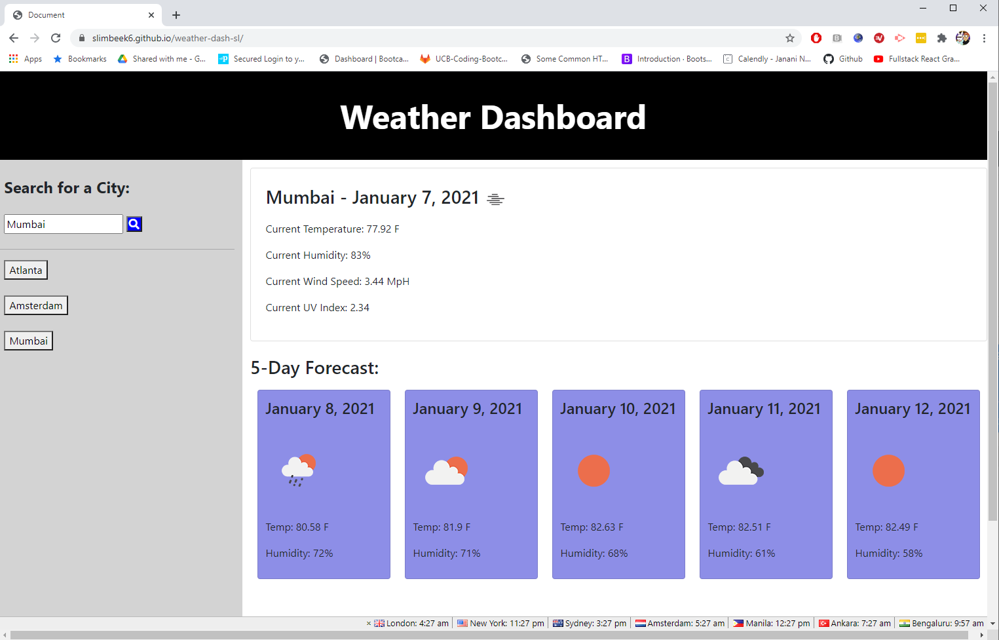

# Weather Dashboard


## Summary

The ask was to create a dynamically updated weather dashboard, where a user can choose the city they would like, and they will be returned the current weather conditions, as well as a five day weather forecast.

<hr>

## Example of Output


## Pseudo Code & Key Code Elements

There were 5 key steps to creating the page, and updating the back-end to create the working dashboard.

**Creating the HTML Backbone**

First was the creation of the HTML and CSS Backbone. This involved establishing the desired output visuals, and creating the necessary HTML elements that will be able to display the desired information.

Once we have defined and coded the initial output view in HTML, we need to overlay CSS to ensure that the information is presented in a clean and digestible fashion.

To do this, we used a combination of Bootstrap and homemade CSS code, attaching the CSS to the different HTML elements via their classes and html types.


**Calling the Necessary Data**

The key back-end work comes next, which is comprised of fetching the weather data from an external source on the web via an API.

To do this, it was necessary to run a pair of APIs, as the parameters included in the forecast data do not allow for a direct input of a city name.  Because of this the first API pull that is made is to the API endpoint that has the city name as one of the endpoint data elements.

```
$.ajax({
    url: getLatLongURL,
    method: "GET"
}).then(function (response) {
    console.log(response);
    var lat = response.coord.lat;
    var lon = response.coord.lon;
    var cityDisplay = response.name;

    var searchURL = "https://api.openweathermap.org/data/2.5/onecall?lat=" + lat + "&lon=" + lon + "&units=imperial&appid=a45e37d740e9d3f5adbe9fe5c4a14ffc";
```
In this snippet we use the first api pull to take the input city and get the latitude and longitude of the city, as this is the required parameter in the second url to get the full data for the page.

Once we have this second search URL created, we can call on the full dataset of the current and forecasted weather data.  Once we've done this pull, we will need to save all of the information either into variables or an object.

**Creating the Data Elements**

Once we have all of the output information that we need saved down in the back-end of our script, we need to start creating the elements that will show on the page.

We start by appending the city, date, and the current weather icon to the title of the right pane.

After this we add the pulled data to each of the data elements displayed without data currently.

We also wanted to make sure that the UV Index provided a color coding dependent on what range the current UV index is sitting in.  To build this quickly, a set of if, else if functions adding styling to the span in the UV Index element.

```
if (uvIndex > 10) {
    $("#curUVI").attr("style", "background-color: violet; color:white");
}
else if (uvIndex < 2.5) {
    $("#curUVI").attr("style", "background-color: limegreen; color:black");
} 
...
```

At this point we realize that we will need to add in a for loop within the display function to ensure that we are able to display each of the 5 forecast days.

We create the for loop, and have it run from 1 to 5 for each of the desired 5 days in the forecast.  We then add the pulled data to each element of every card.

```
for (i=1; i<6; i++) {
    var laterTemp = response.daily[i].temp.day;
    $("#temp"+i).text(laterTemp + " F");
    ...
```

**Saving and Displaying Previous Searches**

Now that we have created the full initial display function, we need to log the city name searched into a list of buttons on the left side of the page.

To do this, we need to create a button element with both an id and button text of the city name. At this point we need to add the element ot the page, which we do by prepending it into the previous search area.

```
$("#prevSearches").prepend("<button id='"+cityDisplay+"'>" + cityDisplay + "</button><br><br>");
```

**Allowing button utility for Previous Searches**

The last functionality built is creating a second listener beyond the listener for the search function. This listener waits for clicks on the previous search buttons, and then calls a duplicate of the overall function (minus adding another button to the page) based on the city name in the id of the button.

```
$(document).on("click", "#prevSearches", reRunPage);
```

<hr>

## Built With

* [HTML](https://developer.mozilla.org/en-US/docs/Web/HTML)
* [CSS](https://developer.mozilla.org/en-US/docs/Web/CSS)
* [Javascript](https://developer.mozilla.org/en-us/docs/web/javascript)
* [Bootstrap](https://getbootstrap.com/)
* [jQuery](https://api.jquery.com/)
* [OpenWeather](https://openweathermap.org/api)

## Deployed Link

* [See Live Site](https://slimbeek6.github.io/weather-dash-sl/)


## Authors

**Shaun Limbeek** 
- [Link to Portfolio](https://slimbeek6.github.io/SML_Portfolio/index.html)
- [Link to Github](https://github.com/slimbeek6/)
- [Link to LinkedIn](https://www.linkedin.com/in/shaun-limbeek/)

